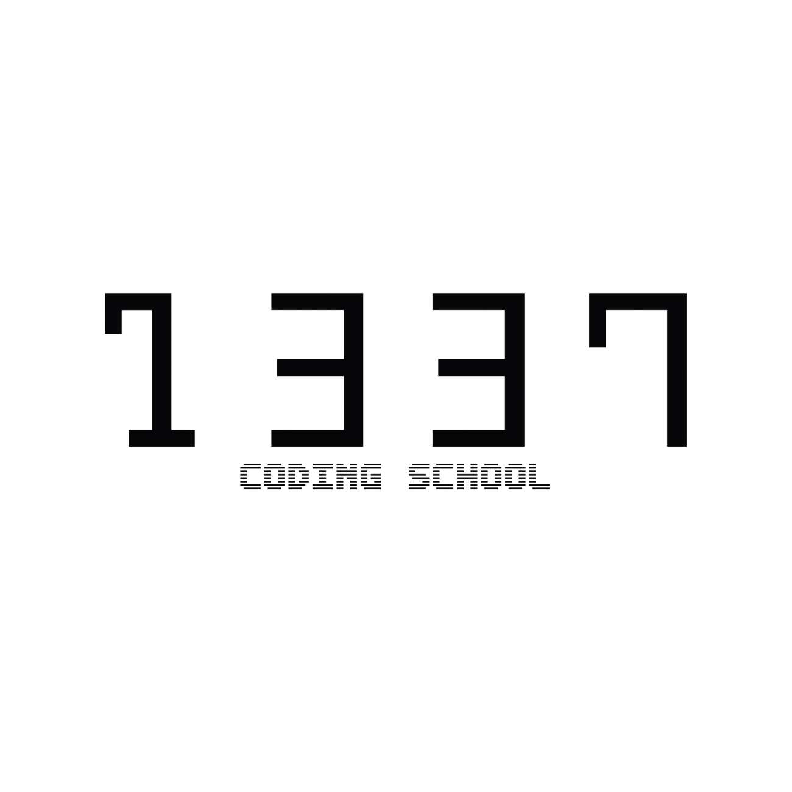

# Piscine 1337 Ben Guerir - Juillet 2021

Ce repo regroupe mon travail effectué pendant les 28 jours que comptent la piscine de 1337 42 network. Grâce a mes efforts et mon travail pendant celle-ci j'ai pu être accepté dans l'école après avoir finis dans le classement 33 sous le nom "anajmi" [1337 Rank Pool](https://najmiachraf.github.io/1337Rank_Pool/Charts_Benguerire.html). D'après mon logtime j'ai travaillé en moyenne 12 heures par jours en comptant les pauses et les repas donc environ 10 heures de travail en moyenne.

Cette expérience est vraiment géniale et j'invite quiconque est intéressé par la programmation, même si vous ne souhaitez pas intégrer l'école, de faire ce mois intensif. C'est 1 mois d'apprentissage intensif mais aussi de bons moments...

## INFO

## Liste des Projets

| PROJET | LANGAGUE | EXPERIENCE | STATUS | Date de Complétion | DOCUMENT | TEST |
| ------ | -------- | ---------- | ------ | ------------------ | -------- | ---- |
|	[C Piscine Shell 00](./Cursus%20C%20Piscine/Shell%2000)	|	shell	|	100 XP	|		|	23-06-2021	|	[fr subject Shell 00](./Subjects/fr.subject.Shell.00.pdf)	|		|
|	[C Piscine Shell 01](./Cursus%20C%20Piscine/Shell%2001)	|	shell	|	100 XP	|		|	25-06-2021	|	[fr subject Shell 01](./Subjects/fr.subject.Shell.01.pdf)	|		|
|	[C Piscine C 00](./Cursus%20C%20Piscine/C%2000)	|	C	|	100 XP	|	 |	27-06-2021	|	[fr subject C 00](./Subjects/fr.subject.C.00.pdf)	|  |
|	[C Piscine C 01](./Cursus%20C%20Piscine/C%2001)	|	C	|	100 XP	|	 |	30-06-2021	|	[fr subject C 01](./Subjects/fr.subject.C.01.pdf)	| [Testing C 01](./Tests/Testing%20C%2001) |
|	[C Piscine C 02](./Cursus%20C%20Piscine/C%2002)	|	C	|	100 XP	|	 |	03-07-2021	|	[fr subject C 02](./Subjects/fr.subject.C.02.pdf)	| [Testing C 02](./Tests/Testing%20C%2002) |
|	[C Piscine C 03](./Cursus%20C%20Piscine/C%2003)	|	C	|	100 XP	|	 |	05-07-2021	|	[fr subject C 03](./Subjects/fr.subject.C.03.pdf)	| [Testing C 03](./Tests/Testing%20C%2003) |
|	[C Piscine C 04](./Cursus%20C%20Piscine/C%2004)	|	C	|	100 XP	|	 |	09-07-2021	|	[fr subject C 04](./Subjects/fr.subject.C.04.pdf)	| [Testing C 04](./Tests/Testing%20C%2004) |
|	[C Piscine C 05](./Cursus%20C%20Piscine/C%2005)	|	C	|	100 XP	|	 |	11-07-2021	|	[fr subject C 05](./Subjects/fr.subject.C.05.pdf)	| [Testing C 05](./Tests/Testing%20C%2005) |
|	[C Piscine C 06](./Cursus%20C%20Piscine/C%2006)	|	C	|	100 XP	|	 |	10-07-2021	|	[fr subject C 06](./Subjects/fr.subject.C.06.pdf)	| [Testing C 06](./Tests/Testing%20C%2006) |
|	[C Piscine C 07](./Cursus%20C%20Piscine/C%2007)	|	C	|	100 XP	|	 |	12-07-2021	|	[fr subject C 07](./Subjects/fr.subject.C.07.pdf)	| [Testing C 07](./Tests/Testing%20C%2007) |
|	[C Piscine C 08](./Cursus%20C%20Piscine/C%2008)	|	C	|	100 XP	|	 |	16-07-2021	|	[fr subject C 08](./Subjects/fr.subject.C.08.pdf)	| [Testing C 08](./Tests/Testing%20C%2008) |
|	C Piscine Exam 00	|	C	|	225 XP	|	 |	25-06-2021	|		|		|
|	C Piscine Exam 01	|	C	|	225 XP	|	 |	02-07-2021	|		|		|
|	C Piscine Exam 02	|	C	|	225 XP	|	 |	09-07-2021	|		|		|
|	C Piscine Final Exam	|	C	|	375 XP	|		|	16-07-2021	|		| [Testing](./Tests/Testing) |

NB: Si tu es piscineux, ne copie/colle pas mon code, tu risquerais un petit -42 en correction 😉.
